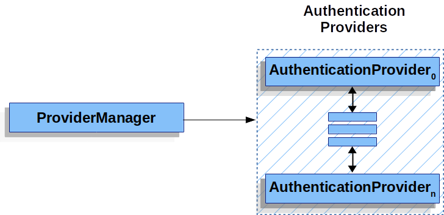
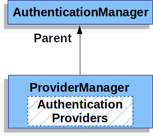
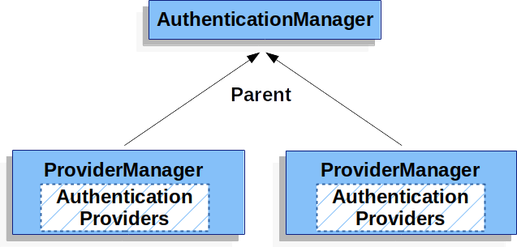

# Authentication Module
There are many type of authorization method and protocols. One popular protocol is ***OAuth***. OAuth is open protocol that allows third party application or web site to access restricted resources on another web site or service. By using the access token strategy a user's login credentials are never stored within an application and only used or required when authenticating a service for the application or user.

The SQLiteConnectionRepository class implements the ConnectionRepository Interface from Spring Social. 

### Set up Spring Security
If Spring Security is on the class path then Spring Boot automatically secures all HTTP endpoints with basic authentication. 

With Gradle we need to add 3 Lines in build.gradle
~~~
implementation 'org.springframework.boot:spring-boot-starter-security'
//  Temporary explicit version to fix Thymeleaf bug
implementation 'org.thymeleaf.extras:thymeleaf-extras-springsecurity6:3.1.1.RELEASE'
implementation 'org.springframework.security:spring-security-test'
~~~

In Maven need to add two extra entries (one for application and one for testing) in the pom.xml.

~~~
<dependency>
	<groupId>org.springframework.boot</groupId>
	<artifactId>spring-boot-starter-security</artifactId>
</dependency>
<dependency>
	<groupId>org.thymeleaf.extras</groupId>
	<artifactId>thymeleaf-extras-springsecurity6</artifactId>
	<!-- Temporary explicit version to fix Thymeleaf bug -->
	<version>3.1.1.RELEASE</version>
</dependency>
<dependency>
	<groupId>org.springframework.security</groupId>
	<artifactId>spring-security-test</artifactId>
	<scope>test</scope>
</dependency>
~~~

#### Basic WebSecurityConfig.java
~~~
package com.example.securingweb;

import org.springframework.context.annotation.Bean;
import org.springframework.context.annotation.Configuration;
import org.springframework.security.config.annotation.web.builders.HttpSecurity;
import org.springframework.security.config.annotation.web.configuration.EnableWebSecurity;
import org.springframework.security.core.userdetails.User;
import org.springframework.security.core.userdetails.UserDetails;
import org.springframework.security.core.userdetails.UserDetailsService;
import org.springframework.security.provisioning.InMemoryUserDetailsManager;
import org.springframework.security.web.SecurityFilterChain;

@Configuration
@EnableWebSecurity
public class WebSecurityConfig {

	@Bean
	public SecurityFilterChain securityFilterChain(HttpSecurity http) throws Exception {
		http
			.authorizeHttpRequests((requests) -> requests
				.requestMatchers("/", "/home").permitAll()
				.anyRequest().authenticated()
			)
			.formLogin((form) -> form
				.loginPage("/login")
				.permitAll()
			)
			.logout((logout) -> logout.permitAll());

		return http.build();
	}

	@Bean
	public UserDetailsService userDetailsService() {
		UserDetails user =
			 User.withDefaultPasswordEncoder()
				.username("user")
				.password("password")
				.roles("USER")
				.build();

		return new InMemoryUserDetailsManager(user);
	}
}
~~~

The ***WebSecurityConfig*** class is annotated with ***@EnableWebSecurity*** to enable Spring Security’s web security support and provide the Spring MVC integration. It also exposes two beans to set some specifics for the web security configuration:

The ***SecurityFilterChain*** bean defines which URL paths should be secured and which should not. Specifically, the / and */home* paths are configured to not require any authentication. All other paths must be authenticated.

When a user successfully logs in, they are redirected to the previously requested page that required authentication. There is a custom */login* page (which is specified by *loginPage()*), and everyone is allowed to view it.

The ***UserDetailsService*** bean sets up an in-memory user store with a single user. That user is given a user name of user, a password of password, and a role of USER.

> HTTP Request > JwtAuthFilter > JwtService > update the SecurityContextHolder > DispatcherServlet

## Authorisation in Spring Security
Spring Security defines the notion of a principal which is currently logged in user. After user's successful authentication, the principal is stored in Spring's security context. It is thread-bound. This makes it available to the rest of service. 
*Security context does not propagate by default in child threads.*

In order to provide authorisation functionality, Spring Security uses the ***AccessDecisionManager*** , which is responsible for delegating authorisation decisions to one or more ***AccessDecisionVoter*** instances.

### Core
***spring-security-core.jar*** contains core authentication and access-control classes and interfaces, remote support and basic provisioning APIs. It Contains the package:
- org.springframework.security.core
- org.springframework.security.access
- org.springframework.security.authentication
- org.springframework.security.provisioning

## Java Configuration
### Hello Web Security Java Configuration
The First step is to create a Spring Security Java Configuration. 
THe configuration creates a servlet Filter Known as the ***SpringSecurityFilterChain***, which is responsible for all the security of the application. 

~~~
@Configuration
@EnableWebSecurity
public class WebSecurityConfig {

	@Bean
	public UserDetailsService userDetailsService() {
		InMemoryUserDetailsManager manager = new InMemoryUserDetailsManager();
		manager.createUser(User.withDefaultPasswordEncoder().username("user").password("password").roles("USER").build());
		return manager;
	}
}
~~~

This configuration is not complex or extensive, but it does a lot:

- Require authentication to every URL in your application

- Generate a login form for you

- Let the user with a Username of user and a Password of password authenticate with form based authentication

- Let the user logout

- CSRF attack prevention

- Session Fixation protection

- Security Header integration:

	- HTTP Strict Transport Security for secure requests

	- X-Content-Type-Options integration

	- Cache Control (which you can override later in your application to allow caching of your static resources)

	- X-XSS-Protection integration

	- X-Frame-Options integration to help prevent Clickjacking

- Integration with the following Servlet API methods:

	- HttpServletRequest#getRemoteUser()

	- HttpServletRequest#getUserPrincipal()

	- HttpServletRequest#isUserInRole(java.lang.String)

	- HttpServletRequest#login(java.lang.String, java.lang.String)

	- HttpServletRequest#logout()

### AbstractSecurityWebApplicationInitializer
Next step is to register the ***springSecurityFilterChain*** with the war file.
We can do so in Java configuration with Spring’s *WebApplicationInitializer* support in a Servlet 3.0+ environment. Not surprisingly, Spring Security provides a base class (*AbstractSecurityWebApplicationInitializer*) to ensure that the springSecurityFilterChain gets registered for you. The way in which we use *AbstractSecurityWebApplicationInitializer* differs depending on if we are already using Spring or if Spring Security is the only Spring component in our application.

### HttpSecurity

~~~
@Bean
public SecurityFilterChain filterChain(HttpSecurity http) throws Exception {
	http
		.authorizeRequests(authorize -> authorize
			.anyRequest().authenticated()
		)
		.formLogin(withDefaults())
		.httpBasic(withDefaults());
	return http.build();
}
~~~

This default configuration consists:
- Ensures that any request requires the user to be authenticated
- authenticate with form based login
- Let user authenticate with HTTP Basic authentication

## Servlet Authentication Architecture

**Servlet Security:** The Big Picture to describe the main architectural components of Spring Security’s used in Servlet authentication.

[SecurityContextHolder](#securitycontextholder) - The SecurityContextHolder is where Spring Security stores the details of who is authenticated.

[SecurityContext](#securitycontext) - is obtained from the SecurityContextHolder and contains the Authentication of the currently authenticated user.

[Authentication](#authentication) - Can be the input to AuthenticationManager to provide the credentials a user has provided to authenticate or the current user from the SecurityContext.

[GrantedAuthority](#grantedauthority) - An authority that is granted to the principal on the Authentication (i.e. roles, scopes, etc.)

[AuthenticationManager](#authenticationmanager) - the API that defines how Spring Security’s Filters perform authentication.

[ProviderManager](#providermanager) - the most common implementation of AuthenticationManager.

[AuthenticationProvider](#authenticationprovider) - used by ProviderManager to perform a specific type of authentication.

[Request Credentials with AuthenticationEntryPoint](#requestcredentials-with-authenticationentrypoint) - used for requesting credentials from a client (i.e. redirecting to a log in page, sending a WWW-Authenticate response, etc.)

[AbstractAuthenticationProcessingFilter](#abstractauthenticationprocessingfilter) - a base Filter used for authentication. This also gives a good idea of the high level flow of authentication and how pieces work together.

### SecurityContextHolder
It is the heart of the spring security's authentication model. It contains:

Here the Spring Security stores the details of the user who is authenticated. Spring Security does not care how the SecurityContextHolder is populated. If it contains a value, it is used as the currently authenticated user.

~~~
SecurityContext context = SecurityContextHolder.createEmptyContext(); 
Authentication authentication =
    new TestingAuthenticationToken("username", "password", "ROLE_USER"); 
context.setAuthentication(authentication);

SecurityContextHolder.setContext(context); 
~~~

To obtain information about the authenticated principal, access the SecurityContextHolder.

***Currently Authenticated UserInformation***

~~~
SecurityContext context = SecurityContextHolder.getContext();
Authentication authentication = context.getAuthentication();
String username = authentication.getName();
Object principal = authentication.getPrincipal();
Collection<? extends GrantedAuthority> authorities = authentication.getAuthorities();
~~~

by default the security context holder is ThreadLocal to store the details. It's always available to the methods in same thread. **Spring Security's ***FilterChainProxy*** ensures that the SecurityContext is always created.**

### SecurityContext
The SecurityContext is obtained from the [SecurityContextHolder](#securitycontextholder). The SecurityContext contains an [Authentication](#authentication) object. 

### Authentication
Authentication Interface serves 2 main purpose within Spring Security.
- An input to [AuthenticationManager](#authenticationmanager) to provide the credentials a user has provided to authenticate
- Represent the currently authenticated user. we can also current authentication from [SecurityContext](#securitycontext).

**Authentication Contains:**
- **principal:** Identifies the user. When authenticating with a username/password this is ofter an instance of UserDetails.
- **credentials:** Ofter a password. In many cases, this is cleared after the user is authenticated to ensure that it is not leaked.
- **authorities:** The GrantedAuthority instances are high-level permissions the user is granted. Like: roles and scope.

### GrantedAuthority
GrantedAuthority instances are high-level permissions that the user is granted. Two examples are roles and scopes.

GrantedAuthority objects are application-wide permissions. They are not specific to a given domain object. 

### AuthenticationManager
AuthenticationManager is the API that defines how Spring Security Filters perform [Authentication](#authentication). The Authentication that is returned is then set on the SecurityContextHolder by the controller that invokes the AuthenticationManager. If we are not integrating with Spring Security;s Filters instances, we can set the [SecurityContextHolder](#securitycontextholder) directly and are not required to use an AuthenticationManager.

### ProviderManager
ProviderManager is the most commonly used implementation of AuthenticationManager. ProviderManager delegates to a list of AuthenticationProvider instances. 

Each AuthenticationProvider knows how to perform a specific type of authentication. We can perform different type of Authentication by only exposing a  single AuthenticationManager bean.

ProviderManager also allows configuring an optional parent AuthenticationManager, which is consulted in the event that no AuthenticationProvider can perform authentication. The parent can be any type of AuthenticationManager, but it is often an instance of ProviderManager.

Multiple ProviderManager instances might share the same parent AuthenticationManager. This is somewhat common in scenarios where there are multiple SecurityFilterChain instances that have some authentication in common (the shared parent AuthenticationManager), but also different authentication mechanisms (the different ProviderManager instances).

By default, ProviderManager tries to clear any sensitive credentials information from the Authentication object that is returned by a successful authentication request. This prevents information, such as passwords, being retained longer than necessary in the HttpSession.

### AuthenticationProvider
In a Provider Manager we can add multiple AuthenticationProvider's instances. For Example: 

### RequestCredentials with AuthenticationEntryPoint
***AuthenticationEntryPoint*** is used to send an HTTP response that requests credentials from a clint. If user provides credentials then we don't need to provide HTTP response to collect user information. 

If user or clint makes an unauthenticated request that is not authorized then we can implements *AuthenticationEntryPoint* to request credentials from clint. 

### AbstractAuthenticationProcessingFilter
AbstractAuthenticationProcessingFilter is used as a base Filter for authenticating a user's credentials. Before the credentials can be authenticated, Spring Security typically requests the credentials by using *AuthenticationEntryPoint*.

1. When the user submits their credentials, the AbstractAuthenticationProcessingFilter creates an Authentication from the HttpServletRequest to be authenticated. The type of Authentication created depends on the subclass of AbstractAuthenticationProcessingFilter. For example, UsernamePasswordAuthenticationFilter creates a UsernamePasswordAuthenticationToken from a username and password that are submitted in the HttpServletRequest.

2. Authentication is passed into the [AuthenticationManager](#authenticationmanager) to be authenticated.

3. If Authentication failed
	- [SecurityContextHolder](#securitycontextholder) is cleared out.
	- RememberMeService.loginFain is invoked.
	- AuthenticationFailureHandler is invoked.

4. If SuccessfulAuthentication
	- SessionAuthenticationStrategy is notified of a new login.
	- Authentication is set on the [SecurityContextHolder](#securitycontextholder) 
	- RememberMeService.loginSuccess in invoked.
	- ApplicationEventPublisher publishes an *InteractiveAuthenticationSuccessEvent*.
	- AuthenticationSuccessHandler is invoked.

## Username/Password Authentication
Spring Security provides comprehensive support for authenticating with a username and password.

~~~
@Configuration
@EnableWebSecurity
public class SecurityConfig {

	@Bean
	public SecurityFilterChain securityFilterChain(HttpSecurity http) throws Exception {
		http
			.authorizeHttpRequests((authorize) -> authorize
				.anyRequest().authenticated()
			)
			.httpBasic(Customizer.withDefaults())
			.formLogin(Customizer.withDefaults());

		return http.build();
	}

	@Bean
	public UserDetailsService userDetailsService() {
		UserDetails userDetails = User.withDefaultPasswordEncoder()
			.username("user")
			.password("password")
			.roles("USER")
			.build();

		return new InMemoryUserDetailsManager(userDetails);
	}

}
~~~

#### Publish an AuthenticationManager bean
#### Customize the AuthenticationManager
#### 