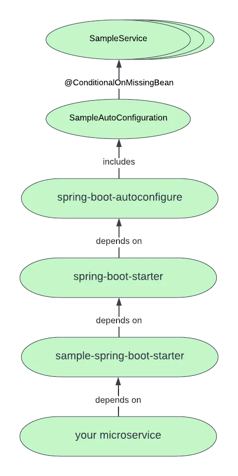

# Spring Boot Custom Library

## Creating Own Auto-configuration
If we want to build a shared library or a open-source or commercial library then we may consider building our own auto-configuration. Auto-configuration classes can be bundled in external jars and still be picked up by Spring Boot.

Auto-configuration is associated to a ***"starter"*** that provides the auto-configuration code as well as the typical libraries that you would use with it. 

### Auto-Configured Beans

Class that implement auto-configuration are annotated with ***@AutoConfigure***. This is a meta annotation with ***@Configuration*** . We can also use **@Conditional** annotation to constrain when the auto-configuration will be applied. It use @ConditionalOnClass and @ConditionalOnMissingBean annotation to ensure functionality applies when then relevant classes are found and when not declared own ***@Configuration***.

[Reference-Git-Link](https://github.com/spring-projects/spring-boot/tree/v3.1.5/spring-boot-project/spring-boot-autoconfigure/src/main/java/org/springframework/boot/autoconfigure/amqp)

### Locating Auto-configuration Candidate
Spring Boot checks for the presence of a *META-INF/spring/org.springframework.boot.autoconfigure.AutoConfiguration.imports* file within the published jar.

    Auto-configurations must be loaded only by being named in the imports file. Make sure that they are defined in a specific package space and that they are never the target of component scanning. Furthermore, auto-configuration classes should not enable component scanning to find additional components. Specific @Import annotations should be used instead.

We can use *before*, *beforeName*, *after* and *afterName* attributes on the @AutoConfiguration to specify the order.

### Conditional Annotations
we can add ***@Conditional*** annotations on auto-configuration class. 

@Conditional annotation includes:
- Class Condition
- Bean Conditions
- Property Conditions
- Resource Conditions
- Web Application Conditions
- SpEL Expression Conditions

## Creating Own Starter
A Custom starter can contain:
- The ***autoconfigure*** module that contains the auto-configure code.
- the ***starter*** module that provides a dependency to the ***autoconfigure*** module and any additional dependencies that are typically useful. In a nutshell adding the starter should provide everything needed to start using that library.

### Naming
Need to provide a proper namespace for starter. should name a combine module after a starter. Example: auto config module name: *acme-spring-boot* and starter *acme-spring-boot-starter*.

### Configuration Keys
Should use a unique namespace. Should not use a namespace that spring boot uses like: *server, management, spring and so on*. 

    @ConfigurationProperties("acme")
    public class AcmeProperties {

        /**
        * Whether to check the location of acme resources.
        */
        private boolean checkLocation = true;

        /**
        * Timeout for establishing a connection to the acme server.
        */
        private Duration loginTimeout = Duration.ofSeconds(3);

        // getters/setters ...

    }
~~~
You should only use plain text with @ConfigurationProperties field Javadoc, since they are not processed before being added to the JSON.
~~~

Rules:
- Do not start the description by "The" or "A".

- For ***boolean*** types, start the description with "Whether" or "Enable".

- For collection-based types, start the description with "Comma-separated list"

- Use java.time.Duration rather than long and describe the default unit if it differs from milliseconds, such as "If a duration suffix is not specified, seconds will be used".

- Do not provide the default value in the description unless it has to be determined at runtime.

### The ***"autoconfigure"*** Module

The ***autoconfigure*** module contains everything that is necessary to get started with the library. It may also contain configuration key definitions such as ***@ConfigurationProperties*** and any callback interface that can be user to further further customize how the components are initialized.

~~~
You should mark the dependencies to the library as optional so that you can include the AutoConfigure module in your projects more easily. If you do it that way, the library is not provided and, by default, Spring Boot backs off.
~~~

Spring Boot uses an annotation processor to collect the conditions on auto-configurations in a metadata file (META-INF/spring-autoconfigure-metadata.properties). If that file is present, it is used to eagerly filter auto-configurations that do not match, which will improve startup time. It is recommended to add the following dependency in a module that contains auto-configurations:

    <dependency>
        <groupId>org.springframework.boot</groupId>
        <artifactId>spring-boot-autoconfigure-processor</artifactId>
        <optional>true</optional>
    </dependency>

If defined auto-configurations directly in application, must configure the ***spring-boot-maven-plugin*** to prevent the **repackage**.
~~~
<project>
    <build>
        <plugins>
            <plugin>
                <groupId>org.springframework.boot</groupId>
                <artifactId>spring-boot-maven-plugin</artifactId>
                <configuration>
                    <excludes>
                        <exclude>
                            <groupId>org.springframework.boot</groupId>
                            <artifactId>spring-boot-autoconfigure-processor</artifactId>
                        </exclude>
                    </excludes>
                </configuration>
            </plugin>
        </plugins>
    </build>
</project>
~~~

With Gradle 4.5 and earlier, the dependency should be declared in the compileOnly configuration, as shown in the following example:

    dependencies {
        compileOnly "org.springframework.boot:spring-boot-autoconfigure-processor"
    }

With Gradle 4.6 and later, the dependency should be declared in the annotationProcessor configuration, as shown in the following example:

    dependencies {
        annotationProcessor "org.springframework.boot:spring-boot-autoconfigure-processor"
    }

### Starter Module
The starter is an empty jar. Its only purpose is to provide the necessary dependencies to work with the library. It is an opinionated view of what is required to get started.

Do not make assumptions about the project in which your starter is added. If the library you are auto-configuring typically requires other starters, mention them as well. Providing a proper set of default dependencies may be hard if the number of optional dependencies is high, as you should avoid including dependencies that are unnecessary for a typical usage of the library. In other words, you should not include optional dependencies.

> **NOTE** 
> Either way, your starter must reference the core Spring Boot starter (spring-boot-starter) directly or indirectly (there is no need to add it if your starter relies on another starter). If a project is created with only your custom starter, Spring Boot’s core features will be honoured by the presence of the core starter.

## Custom Library
- DRY(Don't Repeat Yourself) principle encourages us to create code that can be reused. We pull duplicated code into abstractions such as a custom library that we can call from multiple places. Custom libraries are the key solution for code duplication between microservices.

### Design
- Don't write any domain-specific code inside the custom libraries.
- Even shared code that is business-related is probably not supposed to be inside the custom libraries.
- Think common denominator. Think abstraction. Think base behavior. These are the  candidates for custom libraries.

### Build Custom Libraries
#### Step 1: Choose between Multi Modules or Single Module
- The *autoconfigure* module that contains the auto-configure code for the library logic.
- The *starter* module that provides a dependency to the *autoconfigure* module as well as the library logic and any additional dependencies that are typically useful. Provide everything needed to start using that library.

#### Step 2: Choose a Library Name
Guideline from Spring on the custom library naming convention is that we should start the name with our library name first, followed by "**-spring-boot-starter***".
 Example: name a custom library:
 artifact id is: ***"sample-spring-boot-starter"*** 

 **Be sure to specify the artifact id for the library in its pom, for example:**
 ~~~
 <groupId>com.github.wenqiglantz.library</groupId>
<artifactId>sample-spring-boot-starter</artifactId>
<version>0.0.1-SNAPSHOT</version>
~~~

#### Step 3: Changes in pom.xml
- Need to ensure pom *parent* is specified.
~~~
<parent>
    <groupId>org.springframework.boot</groupId>
    <artifactId>spring-boot-starter-parent</artifactId>
    <version>3.0.0-M5</version>
    <relativePath/> <!-- lookup parent from repository -->
</parent>
~~~
- Also add ***spring-boot-autoconfigure*** dependency.
~~~

<dependency>
    <groupId>org.springframework.boot</groupId>
    <artifactId>spring-boot-autoconfigure</artifactId>
</dependency>
~~~

#### Step 4: Create Service Layer Main Logic of Custom Library
This is the shared code we wanted to extract into our custom library.

#### Step 5: Create Custom Auto-Configuration Class
This is combined with step 6, is the crux of how our custom library becomes a custom Spring Boot starter.

~~~
@Configuration
@ConditionalOnClass(SampleService.class)
public class SampleAutoConfiguration {

    @Bean
    @ConditionalOnMissingBean
    public SampleService sampleService() {
        return new SampleService();
    }
}
~~~

- The @ConditionalOnClass annotation lets SampleService classes be included based on the presence of SampleService class in ApplicationContext.
- The @ConditionalOnMissingBean annotation indicates the sampleService bean is going to be created if no bean of type SampleService is already contained in the ApplicationContext.

#### Step 6: Add spring.factories to Reflect this Custom Auto-Configure Class

When Booting up Spring boot automatically checks for the spring.factories file. It checks for the presence of a spring.factories file under META-INF file directory within my jar file. The file lists configuration classes under the **EnableAutoConfiguration** key.

For sample, we instruct Spring Boot to load our SampleAutoConfiguration class as a candidate for EnableAutoConfiguration in our META-INF/spring.factories:

    org.springframework.boot.autoconfigure.EnableAutoConfiguration=com.github.wenqiglantz.library.sample.config.SampleAutoConfiguration

Once the custom library is ready then we can use this like other spring boot starter library.

## Dependency Hierarchy

## Monorepo of Custom Libraries

### Pros
- Better visibility and collaboration across teams. Its easier to discover and leverage.
- Simplified dependency management. Monorepo helps to simplify internal and third-party dependency management. Helps to address challenges like diamond dependency problem andd concern of having multiple projects with multiple versions of same dependency.
- Simplified releases. When building a new release we create the same version for all the libraries, so when consuming the libraries we can have a single version for all of them.

### Cons
- Limitation with git access control. 
- Open source vulnerability prioritization and licensing.

### Ref Links
https://betterprogramming.pub/developing-custom-libraries-with-spring-boot-starter-cf463a5eca39 

https://docs.spring.io/spring-boot/docs/2.6.7/reference/htmlsingle/#features.developing-auto-configuration.custom-starter