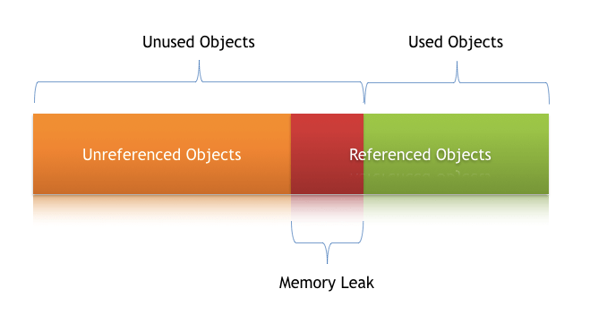

# Memory Leaks in Java
One of the core benefits of Java is the automated memory management with the help of the built-in **Garbage Collector( GC )**. The GC implicitly takes care of allocating and freeing up memory, and this handles the majority of memory leak issues. **But it doesn't guarantee thee foolproof solution of memory leakage.**  
There might still be situations where the application generates a substantial number of **Unnecessary objects**, thus depleting crucial memory resources, and sometimes resulting in the whole application’s failure.

### Memory Leak
Memory leak is a situation where the objects are present but there is no use of that object and  the garbage collector is unable to remove them from the memory.  
If we don't deal with it there is a possibility that this will cause performance issues over time. The GC removes unreferenced objects periodically but never collects the objects that is still referenced. 

### Symptoms of a Memory Leak
- Severe performance degradation when the application is continuously running for a long time
- OutOfMemoryError heap error in the application
- Spontaneous and strange application crashes
- The application is occasionally running out of connection objects.

## Types od Memory Leaks
### Memory Leak through *static* Fields
- heavy use of static variables in code. static fields have a entire lifetime of the running application unless the class becomes GC.
    ~~~
    public class StaticFieldsMemoryLeakUnitTest {
        public static List<Double> list = new ArrayList<>();

        public void populateList() {
            for (int i = 0; i < 10000000; i++) {
                list.add(Math.random());
            }
            Log.info("Debug Point 2");
        }

        public static void main(String[] args) {
            Log.info("Debug Point 1");
            new StaticFieldsDemo().populateList();
            Log.info("Debug Point 3");
        }
    }
    ~~~
    on this code block when we leave the populateList() method at the debug point 3 but the heap memory is not the garbage collected yet. but if we drop the static keyword then will we be collected by GC as there is no reference on it.
- by declaring a large object or list will hold the memory space of application lifetime.

#### Prevent
- maximize the use of *static* variable
- when use singletons< rely on the implementation that lazily loads the object instead eagerly loading.

### Through Unclosed Resource
Whenever we use new connection or open stream the JVM will allocates corresponding memory for this resource.
- like: *Database connections*, *input Stream*, *session Objects*.

if we don't close this connection then these open connections reach out of GC's range. sometimes this occurs for throwing exception before closing the connections.

- This may result the *OutOfMemoryError*

#### Prevent
- Always use Finally block when we need to close resources
- The codes inside the Finally should not contain any exception
- On Java 7+ we can use try-with-resources block
    ~~~
    try (FileReader fr = new FileReader(path);
	         BufferedReader br = new BufferedReader(fr)) {
	        return br.readLine();
	    }
    ~~~

### Improper *equals()* and *hashCode()* Implementations
While declaring a new class we shouldn't oversight *equals()* and *hashCode()* method. if they are not properly declared they can become the source for memory leak. 

For this small ignorance equals object can pile up and can lead to performance issues for heap memory in VirtualVM.

#### Prevent
- As a rule of thumb, when defining new entities, always override the equals() and hashCode() methods.
- It’s not enough to just override, these methods must be overridden in an optimal way as well.

### Inline Classes That Reference Outer Classes
When we declare a non static inner class and the Class contains a bulky object then if we declare inner class object then it holds a lot of memory.
#### Prevent
 - Migrating to latest version of Java. ZGC uses root references to find unreachable objects.
 - If possible make inner class static

### Through *finalize()* methods
Whenever we override *finalize()* method then the objects of that class are not instantly garbage collected. If there is a problem on method or isn't optimize then sooner or later there is a chance of *OutOfMemoryError*.

#### Prevent
 - Always try to avoid finalize method

### Interned String
Java String pool went through major changes on java 7. On codes java 6 or below we need to be more attentive when working with large string. **If we read a massive String object, and call intern() on that object, it goes to the string pool, which is located in PermGen (permanent memory), and will stay there as long as our application runs.**

#### Prevent
- The simplest way to resolve this issue is by upgrading to the latest Java version, as String pool moved to HeapSpace starting with Java version 7.
- If we’re working on large Strings, we can increase the size of the PermGen space to avoid any potential OutOfMemoryErrors:

### Using ThreadLocals
When using this construct, each thread will hold an implicit reference to its copy of a ThreadLocal variable and will maintain its own copy, instead of sharing the resource across multiple threads, as long as the thread is alive.

Despite its advantages, the use of ThreadLocal variables is controversial, as they’re infamous for introducing memory leaks if not used properly. Joshua Bloch once commented on thread local usage that:
~~~
“Sloppy use of thread pools in combination with sloppy use of thread locals can cause unintended object retention, as has been noted in many places. But placing the blame on thread locals is unwarranted.”
~~~

Since Thread Pools in application servers work on the concept of thread reuse, they’re never garbage collected; instead, they’re reused to serve another request.
If any class creates a ThreadLocal variable, but doesn’t explicitly remove it, then a copy of that object will remain with the worker Thread even after the web application is stopped, thus preventing the object from being garbage collected.

#### Prevent
- Clean-up ThreadLocals when we're no longer using them. It has remove() method
- Don’t use **ThreadLocal.set(null)** to clear the value. It doesn’t actually clear the value, but will instead look up the Map associated with the current thread and set the key-value pair as the current thread and null, respectively.
- Its better to close ThreadLocals on finally block.

### Other Strategies for Dealing With Memory Leaks
####  Enable Profiling
Using profilers, we can compare different approaches and find areas where we can optimally use our resources.

#### Verbose Garbage Collection
 By enabling this we can track the detailed trace of the GC. To enable this:

    -verbose:gc

   
 ## ZGC ( Z Garbage Collector )

 ZGC manages to keep low pause times on even multi-terabyte heaps

 As OS dynamically allocate memory spaces and when we remove a object of bulk of the data the memory space in between remains free as long we don't allocate another object of that free space. To allocate we need to calculate or scan through memory to check whether the object will hold on that space or not. It's very expensive. To solve this we use the memory as a block and we know which block is free or not and place object there. 

 But in Java we don't have to allocate or free the spaces. The GC handles these for us. It looks for the objects that we can not reach through our applications then frees up the spaces. 

 ### GC Phase Properties
 **Properties:**
 - **Parallel** phase run on multiple GC threads.
 - **Serial** phase runs on a single thread
 - **Stop-the-word** phase can't run concurrently with application code.
- **Concurrent** phase can rin in the background while our application works
- **Incremental** phase can terminate before finishing all of its work and continue it later

***ZGC*** uses a different approach , **It stores the reference state as the bits of the reference**
 
ZGC has a phase making, here we find all the reachable objects. ZGC intends to provide stop-the-world phases as short as possible. It achieves it in such a way that the duration of these pause times doesn’t increase with the heap size. These characteristics make ZGC a good fit for server applications, where large heaps are common, and fast application response times are a requirement. **Since ZGC doesn’t want long pause times, it does most of the relocating in parallel with the application.** 

Load barriers fix the references pointing to relocated objects with a technique called remapping. starting JDK 16, ZGC got support for in-place relocation
