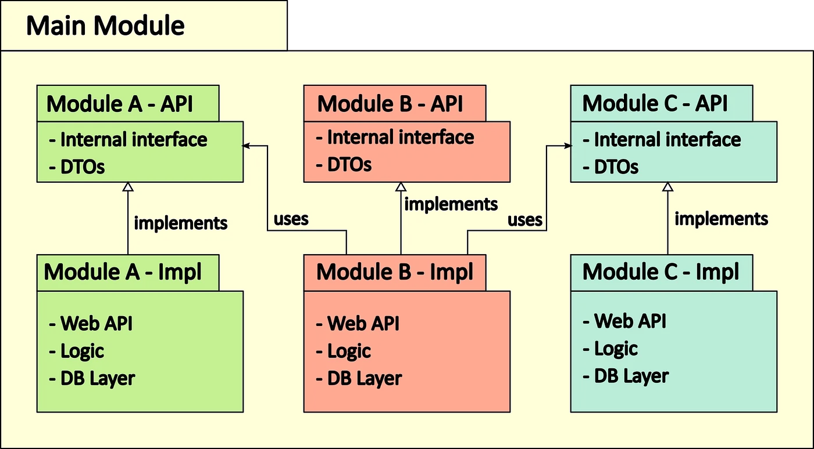

A multi-module project is one in which there could be child-parent relationships between different components of your project. And you want all your code in a single project, separated apart in different components, having one or more common dependencies and can be executed as a single or multiple jars or deployments.

### The structural idea

### Main Module
Its basically the monolith application that we are used to build before. This is basically your previous monolith in regards to the application frame, configurations and build artifact. It depends on all implementation modules, defines common dependencies and configurations for runtime. Depending on the used framework it might have to hold things like database connections as well.

### Implementation Module
API, business logic, persistence layer, automated tests and other logic takes place here. Each module represents a functional part of the whole application.
- Should be designed at independent as possible.
- May use other modules via their API.
- May have it's own configuration. But still it should be orchestrated by the main module.

### API Module
- Not every functional module have API but the dependencies between modules should be here/ introduced. 
- The only purpose is to provide an internal API to the matching implementation module. Hence, only interfaces and data transfer objects (DTOs) should be present here. Only what is necessary, to let other modules be able to send or receive data.

## Technical part
### For Gradle
#### Declaring the modules
For Gradle to recognize the modular structure, all modules have to be declared within the settings.gradle file at the root of your project. Hierarchy levels can be defined with the colon (:) symbol. For example, module:pet:api corresponds with module/pet/api as folder structure.

Gradle analyses the structure and recognizes modules with matching folders, containing a build.gradle. For the example Modulith above, the settings.gradle looks like the following:
~~~
rootProject.name = 'modulith'
include 'modules:a:a-api', 'modules:a:a-impl'
include 'modules:b:b-api', 'modules:b:b-impl'
include 'modules:c:c-api', 'modules:c:c-impl'
~~~

[Git Hub Link for Ref](https://github.com/norbertspiess/gradle-modulith/blob/ce35431f94c9573f9d880687a2803998c0cb9371/build.gradle#L35)

### Synchronous Communication
Here Asynchronous communication is preferred but synchronous communication between modules is easily achievable.
It’s the synonym of calling a different micro service via a synchronous HTTP API.

>**NOTE**
> *As in the situation of distributed services, you want to avoid synchronous communication as much as possible. As it creates dependencies that are hard to get rid of afterwards. Be careful to not create dependency loops as well.*

Instead of a web API, define a Java interface within the api module and write a matching implementation in the respective impl module. Every module depending on the interface needs to declare the dependency to the api module only.

### Asynchronous Communication
The goal should be to strive for event or message based communication. 
Several frameworks (like Guava, MBassador, EventBus, etc.) are available for in memory events. Spring provides it’s own mechanism even, as the framework heavily depends on internal events itself.

### Pitfalls

#### Module dependency
First of all, there’s an immediate danger of interweaving many modules with each other. The more modules depend on each other, the more you’ll have to untangle them. Sounds familiar to a distributed monolithic? That’s because the underlying modelling issues are the same.
If you run into cyclic dependencies within the Spring context, use @Lazy injection. It can be a possible smell in your architecture or a limitation of having one global Spring runtime.

#### Complicated configuration
Its basically a monolith Application. Some configuration can be complicated. If different module have different Database connection then it will be bit complicated. 

#### Error Handling
On Asynchronous communication we should monitor error very closely.

[Git Hub Link for Ref- ](https://github.com/norbertspiess/gradle-modulith/)

### Ref links
[Youtube](https://www.youtube.com/watch?v=DG9B2w-N42s) 
[Documentation](https://spring.io/guides/gs/multi-module/#scratch)  
[Medium Documentation](https://worador.medium.com/building-a-modular-spring-boot-monolith-b42ab3e424a8)