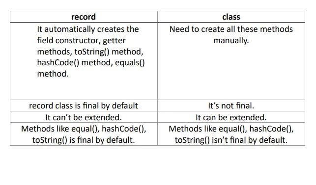

# Record

Record is a special immutable class that eliminates the need to write verbose code as it requires only the name and type of the fields.

    public record EmployeeRecord(int empId, String name, double salary) {}

### Non-canonical constructor
We can also write a non-canonical constructor in the record to initialize only specific fields but we have to delegate a call to the canonical constructor using this keyword.

    //Non-canonical constructor
    public record EmployeeRecord(int empId, String name, double salary) {
        public EmployeeRecord(int empId){
            this(empId,null,0);
        }
    }

### Compact Constructor
A compact constructor has implicit parameters corresponding to each record component thereby matching the declaration of the record. By using a compact constructor we can customize the value of any field in a compact way.

> **Note**
> In compact constructors, we can not use this to reference fields.

    //Compact Constructor
    public record EmployeeRecord(int empId, String name, double salary) {
        public EmployeeRecord{
            if(Double.compare(salary,0)==-1)
                salary = 0;
        }
    }

### Static Fields and Methods
In records, we can declare static fields and methods that can be accessed using the record name.

    //Static field and method in record
    public record EmployeeRecord(int empId, String name, double salary) {

        public static int employeeCount;

        public EmployeeRecord{
            employeeCount = employeeCount+1;
        }

        public static int getEmployeeCount(){
            return employeeCount;
        }
        
    }

    public static void main(String[] args) {
            EmployeeRecord.employeeCount = 0;
            EmployeeRecord empRecord = new EmployeeRecord(123, "Sarthak", 50000);
            System.out.println(empRecord);
            System.out.println("Total Count of Employees: "+EmployeeRecord.getEmployeeCount());
    }

### Instance Fields and Methods
We can also write instance methods in the record body but we **can not declare any other instance variable** in the record apart from the fields declared in the record header.
~~~
//Instance method in record
public record EmployeeRecord(int empId, String name, double salary) {
    public double getProvidentFundAmount(){
        return 0.12*salary;
    }
}
~~~

### Inheritance in Records
Records are implicitly declared as final so a record can not be extended.
Records extend java.lang.Record, as multiple inheritance is not allowed in Java so a record can not extend any other class.
However, records can implement interfaces.

### Serialization and Deserialization
Java Records can be serialized and deserialized by implementing the serializable interface.
- We can not customize serialization or deserialization by using writeObject or readObject methods, unlike normal Java classes.
- **Deserialization** in a record is different than it is for a normal class as when a record is deserialized its fields are set using the record’s canonical constructor to the values deserialized from the stream while a normal class is first instantiated by invoking the no-argument constructor, and then its fields are set via reflection to the values deserialized from the stream.
- The serialVersionUID of a record is 0L by default and it is not required for serialization and deserialization of records.

### Local Record
Local Record is a record defined in the method body, it helps in modeling the intermediate values or group of values like inner class, local record increases the use of encapsulation and enhances readability.

> **NOTE**
> Note: As all the fields are final by default, we can’t provide the Setter implementation. 
We can create methods in the record class. 
As fields are final, We can understand that it’s meant to be data carriers.

### Link:
[Medium](https://medium.com/@sarthaktyagiii/java-record-in-depth-guide-22a760fba83a)
